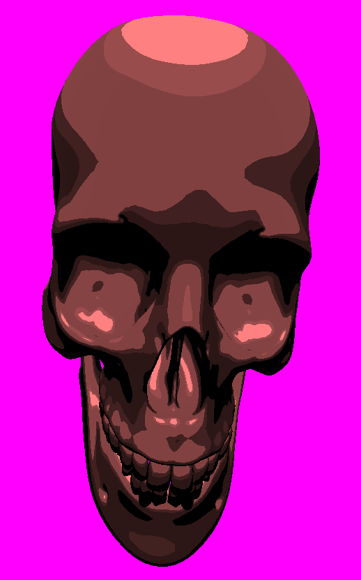

# CelShadingOpenGL

A real-time cel-shading (toon shading) renderer written in C++20, OpenGL 4.5 and GLSL. It loads `.obj` models (textured or not), draws black outlines, and reduces the number of shading bands as objects get farther from the camera.



## Features

- Diffuse lighting quantized into 2 to 4 bands depending on distance to the camera
- Black outlines using the inverted hull technique (two render passes)
- Textured and untextured rendering modes, with multi-material `.obj`/`.mtl` support
- Free-fly camera, movable light, and adjustable outline thickness at runtime

## How it works

1. **Outline pass**: front faces are culled and each vertex is pushed along its normal by `LineThickness`, then drawn in black. Only the slightly inflated back faces remain visible, forming the outline.
2. **Shading pass**: the diffuse term `max(0, dot(normal, light_dir))` is quantized with `floor`, with the number of bands (2 to 4) interpolated from a distance factor. The factor decays either linearly (`smoothed`) or logarithmically.

## Requirements

- C++20 compiler, CMake >= 3.21
- OpenGL 4.5 capable GPU and drivers
- GLEW, freeglut
- [stb_image](https://github.com/nothings/stb) and [tinyobjloader](https://github.com/tinyobjloader/tinyobjloader)

On Debian/Ubuntu:

```bash
sudo apt install build-essential cmake libglew-dev freeglut3-dev libgl1-mesa-dev
```

## Installation

```bash
git clone https://github.com/Zarvork/CelShadingOpenGL.git
cd CelShadingOpenGL/src
mkdir build && cd build
cmake .. && make -j"$(nproc)"
```

A `flake.nix` is also provided for a reproducible Nix environment.

## Usage

```bash
./CelShading <WITH_TEXTURE> <DIRECTORY> <FILE> <SCALE>
```

| Argument | Description |
|----------|-------------|
| `WITH_TEXTURE` | `0` for untextured rendering, anything else for textured |
| `DIRECTORY` | Folder containing the `.obj`, `.mtl` and texture files |
| `FILE` | Name of the `.obj` file |
| `SCALE` | Scale factor applied to the model |

Example:

```bash
./CelShading 1 ../objects model.obj 5.0
```

Shaders are loaded from the relative path `shaders/`, so run the binary from a directory where it resolves.

### Controls

| Key | Action |
|-----|--------|
| `W` `A` `S` `D` / `Q` `E` | Move the camera / go up, down |
| Mouse | Look around (`Space` locks/unlocks the cursor) |
| `Enter` | Reset the camera |
| `T` | Toggle toon shading |
| `Tab` | Toggle linear / logarithmic distance falloff |
| `+` / `-` | Thicker / thinner outlines |
| `U` `J` `H` `K` / `Y` `I` | Move the light |
| `Esc` | Quit |

## Known limitations

- Outline thickness is in world space, so it varies with distance.
- Inverted hull outlines can show gaps on sharp edges when normals are not smoothed.
- Models need normals and UV coordinates.
